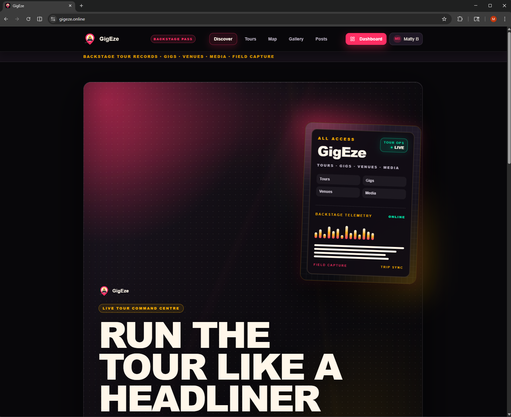
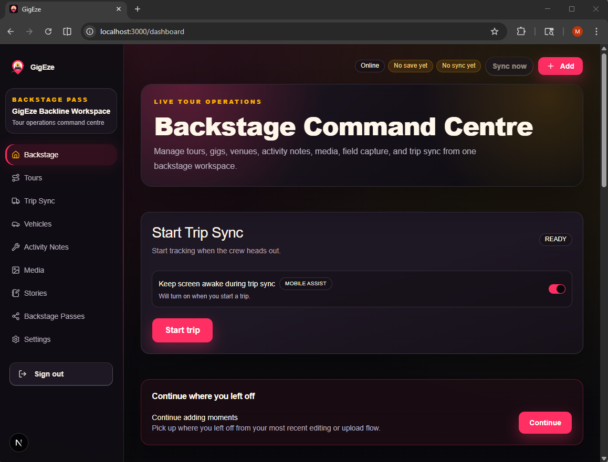
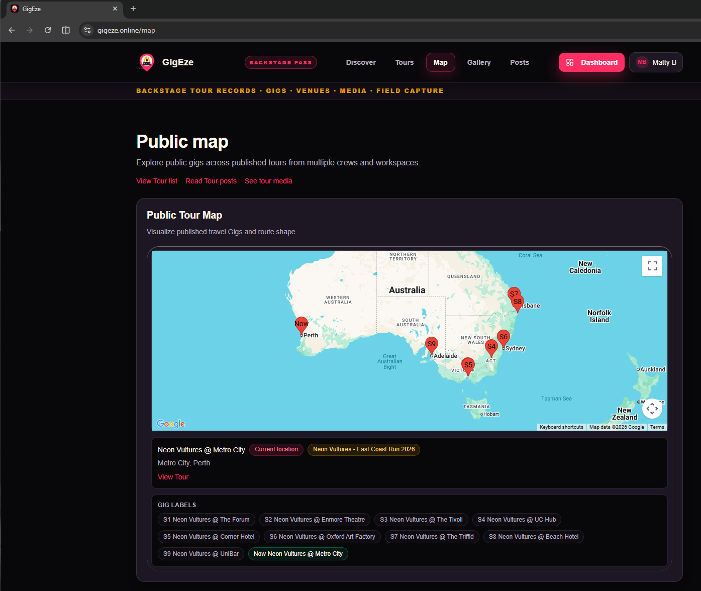
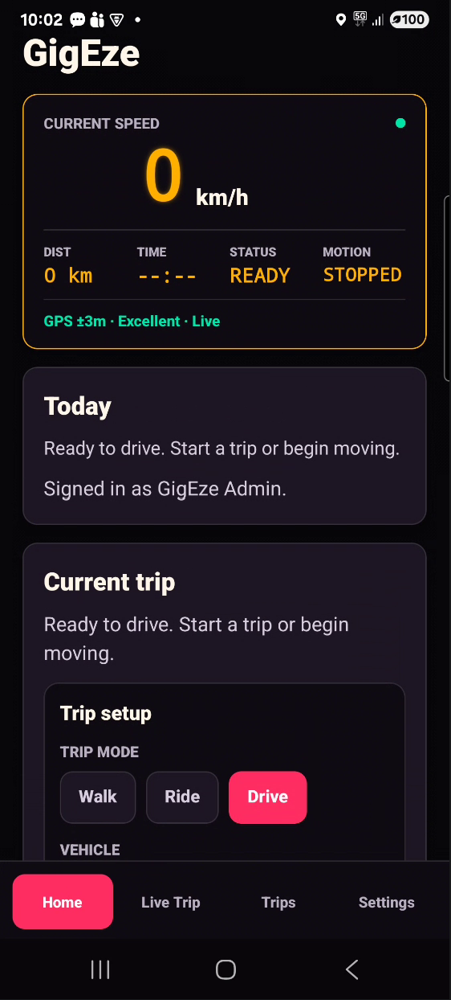
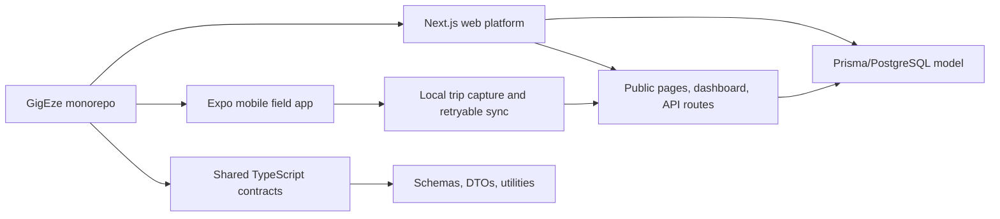

# GigEze

[](#project-status)
[](#tech-stack)
[](#tech-stack)
[](#tech-stack)
[](#tech-stack)

GigEze is a full-stack web and mobile application for tour and live entertainment operations. It brings together tour/gig coordination, field activity capture, media/public presentation, and mobile-to-web synchronization.

The system uses a TypeScript-first monorepo architecture with a Next.js web platform, Expo React Native mobile app, Prisma/PostgreSQL persistence model, Supabase Auth/Storage integration points, and shared contracts for cross-app validation and DTOs.

Production URL: `https://gigeze.online`

## Contents

- [Product Overview](#product-overview)
- [Key Screens](#key-screens)
- [Architecture at a Glance](#architecture-at-a-glance)
- [Key Technical Characteristics](#key-technical-characteristics)
- [Product Concept](#product-concept)
- [Architecture Diagram](#architecture-diagram)
- [Repository Structure](#repository-structure)
- [Tech Stack](#tech-stack)
- [Quick Start](#quick-start)
- [Documentation](#documentation)
- [Future Expansion](#future-expansion)
- [Project Status](#project-status)

## Product Overview

GigEze models the operational layer around live entertainment work: planning tours, managing gigs, capturing field movement, publishing selected public content, and keeping web/mobile workflows aligned.

Core workflows:

- Tour and gig coordination for dates, venues, status, visibility, notes, and operational context.
- Mobile field activity capture for trip sessions, route samples, vehicle context, and completion handoff.
- Authenticated web dashboards for tours, gigs, media, activity notes, vehicles, settings, and synced trip logs.
- Public publishing surfaces for selected tours, stories, maps, gallery content, posts, and shared workspace/profile pages.

## Key Screens

A full visual index is available in [docs/SCREENSHOTS.md](docs/SCREENSHOTS.md).

### Public Homepage



Public product positioning and concert-poster inspired visual identity.

### Dashboard Command Centre



Authenticated command-centre layout with quick actions and current tour context.

### Trip Sync



Field movement records with route history, filters, CSV export, and map previews.

### Mobile Home



Expo mobile field-capture home with live status, GPS quality, trip setup, and signed-in operator context.

## Architecture at a Glance

- Web platform: Next.js 16 App Router for public publishing surfaces, authenticated dashboard workflows, server components, and API routes.
- Mobile field application: Expo React Native app for sign-in, tour selection, vehicle setup, trip capture, trip history, diagnostics, and retryable sync.
- Shared contracts: TypeScript package for schemas, domain types, DTOs, date helpers, distance utilities, and trip/session contracts.
- Sync architecture: local mobile trip state moves through completion, retry, and server ingestion into web-managed operational logs.
- Persistence layer: Prisma 7 schema and migrations targeting PostgreSQL for workspace-scoped tours, gigs, notes, media, vehicles, logs, and GPS samples.
- Auth/storage boundaries: Supabase Auth and Storage integration points isolate sign-in, bearer-token validation, and media upload concerns.

## Key Technical Characteristics

- Shared TypeScript contracts keep mobile payloads, web route handlers, and domain utilities aligned across package boundaries.
- Local-first trip capture protects mobile workflows from network availability, then syncs completed activity through explicit state transitions.
- Prisma acts as the source of truth for a relationship-heavy operational model spanning workspaces, users, tours, gigs, notes, media, posts, vehicles, driving logs, and GPS samples.
- Feature-oriented modules separate domain workflows from framework plumbing in both the Next.js app and Expo app.
- Next.js App Router supports public routes, authenticated dashboard surfaces, API boundaries, server-side data access, and deployment-oriented web structure.
- Expo React Native provides the mobile field workflow: sign-in, trip state, AsyncStorage persistence, route sample handling, and diagnostics.
- Validation and build discipline are first-class through `npm run typecheck`, `npm run test:run`, and `npm run build:web`.

## Product Concept

GigEze is organized around a tour-centric operating model for backstage and live-gig work. A tour is the parent operational container; gigs are the scheduled venue/date records; media, stories, notes, vehicles, and trip logs attach to that operating context.

Core concepts:

- `Tour`: the parent plan for a run of shows, dates, logistics, media, visibility, and notes.
- `Gig`: a specific tour date or venue package, including location, schedule, notes, media, and status.
- `Trip`: a mobile-captured movement or field activity session that can sync into the web system as a draft operational log.
- `Public surfaces`: selected tours, maps, stories, gallery content, posts, and profiles published from backstage records.

## Architecture Diagram

Detailed Mermaid diagrams live in [Architecture overview](docs/architecture-overview.md), [Data model](docs/data-model.md), and [Mobile sync](docs/mobile-sync.md).



## Repository Structure

- `apps/web` - Next.js app, Prisma schema, API routes, dashboard workflows, and public site.
- `apps/mobile` - Expo React Native app for mobile capture, trip history, vehicle setup, diagnostics, and sync.
- `packages/shared` - shared TypeScript schemas, domain types, DTOs, and utilities.
- `docs` - deeper architecture notes, data model details, API notes, mobile sync flow, screenshot gallery, and local development guide.

## Tech Stack

- TypeScript, npm workspaces
- Next.js 16, React 19, Tailwind CSS
- Expo React Native, AsyncStorage
- Prisma 7, PostgreSQL
- Supabase Auth and Storage
- Vitest

## Quick Start

```bash
npm ci
npm run db:generate
npm run db:dev:start:win
npm run db:push
npm run db:seed
```

Run the web and mobile apps:

```bash
npm run dev:web
npm run dev:mobile
```

Run validation:

```bash
npm run typecheck
npm run test:run
npm run build:web
```

For environment setup, seeded login details, mobile env sync, and demo dataset options, see [Local development](docs/local-development.md).

## Documentation

- [Architecture overview](docs/architecture-overview.md)
- [Data model](docs/data-model.md)
- [Mobile sync](docs/mobile-sync.md)
- [API overview](docs/api.md)
- [Architecture decisions](docs/decisions.md)
- [Local development](docs/local-development.md)
- [Demo data](docs/demo-data.md)
- [Screenshots](docs/SCREENSHOTS.md)

## Future Expansion

- Performer and crew profiles with contacts, riders, set times, and availability.
- Venue records with load-in notes, settlement details, and production constraints.
- Day sheets, guest lists, pass management, expenses, and settlement summaries.
- Document storage for contracts, riders, invoices, and insurance.
- Role-based team access across tour, production, artist, and accounting workflows.
- Offline-first gig notes and checklist capture in the mobile app.
- Calendar exports and richer public tour pages for artist, fan, or promoter-facing content.

## Project Status

GigEze is an actively evolving product and architecture playground focused on tour operations, field activity capture, and web/mobile workflow synchronization.
