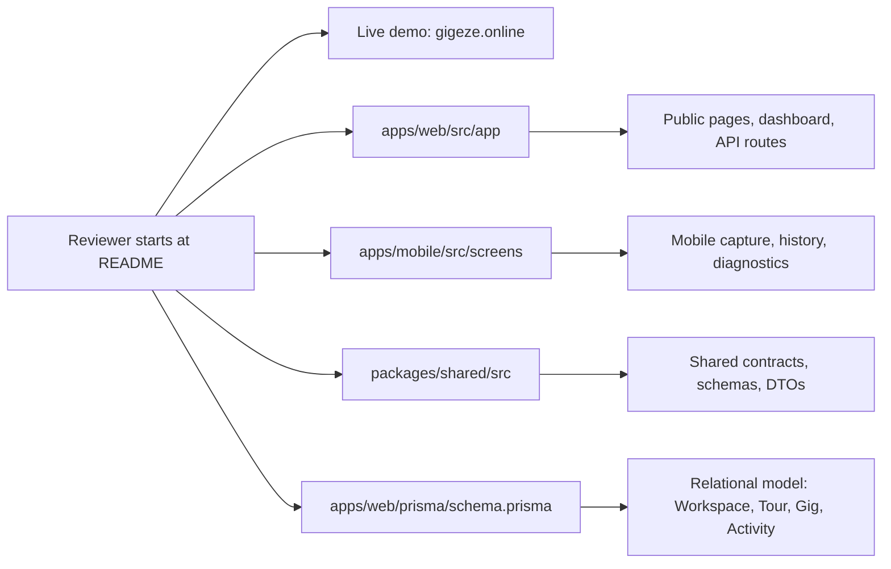

# GigEze

[](#project-status)
[](#tech-stack)
[](#tech-stack)
[](#tech-stack)
[](#tech-stack)

GigEze is a full-stack product engineering portfolio project demonstrating how to design and deliver a modern web and mobile system end-to-end using a TypeScript-first architecture.

The project pairs a Next.js 16 web app with an Expo React Native mobile app, Prisma-managed PostgreSQL data model, Supabase Auth/Storage integration points, and a shared TypeScript package. It is structured for fast technical review so recruiters, hiring managers, and technical leads can assess product thinking, architecture, and implementation depth quickly.

## Contents

- [Why This Matters](#why-this-matters)
- [Live Demo Path](#live-demo-path)
- [Architecture at a Glance](#architecture-at-a-glance)
- [What This Demonstrates](#what-this-demonstrates)
- [Engineering Signals](#engineering-signals)
- [Reviewer Guide](#reviewer-guide)
- [Portfolio Docs](#portfolio-docs)
- [Screenshots](#screenshots)
- [Architecture Diagrams](#architecture-diagrams)
- [Why This Exists](#why-this-exists)
- [Product Concept](#product-concept)
- [Monorepo Layout](#monorepo-layout)
- [Tech Stack](#tech-stack)
- [What Works Now](#what-works-now)
- [Quick Start](#quick-start)
- [Environment](#environment)
- [Demo Notes](#demo-notes)
- [Future Expansion](#future-expansion)
- [Project Status](#project-status)

## Why This Matters

GigEze is designed for hiring managers and technical leads who want evidence beyond a code sample. It shows the ability to turn a domain idea into a working full-stack system: data model, web workflows, mobile capture, shared contracts, integration points, and deployment-aware structure.

This project complements extensive Microsoft, Dynamics 365, and Azure experience by demonstrating equivalent architectural patterns in a modern TypeScript-first stack.

The repository is intentionally structured so architecture, domain modeling, and implementation decisions can be evaluated quickly without prior project context.

## Live Demo Path

Production URL: `https://gigeze.online`

Suggested reviewer path:

- Start with the public pages to assess product framing and presentation.
- Review tour, gig, media, and activity notes workflows in the authenticated web app structure.
- Inspect the mobile trip capture and completed-trip sync implementation in apps/mobile and corresponding API routes in apps/web.

## Architecture at a Glance

- Web: Next.js 16 App Router for public pages, authenticated dashboard workflows, and API routes.
- Mobile: Expo React Native app for sign-in, tour selection, trip capture, history, and diagnostics.
- Data: Prisma 7 schema and migrations targeting PostgreSQL.
- Auth and storage: Supabase Auth/Storage integration points for connected workflows.
- Shared contracts: TypeScript package for schemas, domain types, DTOs, and utilities.
- Sync model: local mobile trip/field activity state with retryable completed-trip sync into the web system.

## What This Demonstrates

- Full-stack application architecture across web, mobile, database, and shared package layers.
- Modern TypeScript delivery with Next.js App Router, React 19, Expo React Native, Prisma, and Vitest.
- Domain modeling for authenticated workspace workflows: tours, gigs, media, activity notes, and trip sync.
- API and integration thinking for auth, storage, mobile sync, and server-side data access.
- Product judgment: clear scope, operational workflows, public-facing pages, and a credible growth path.
- Enterprise engineering habits from Microsoft, Dynamics, and Azure work translated into a modern TypeScript, React, Next.js, and Expo stack.

## Engineering Signals

- Strict TypeScript across web, mobile, and shared package boundaries.
- Shared contracts keep domain types and validation close to the workflows that consume them.
- Prisma schema acts as the source of truth for relational modeling and database evolution.
- Mobile trip sync is designed around local state, retryable completion, and server-side ingestion.
- Validation commands are first-class: `npm run typecheck`, `npm run test:run`, and `npm run build:web`.
- Feature folders separate domain workflows from framework plumbing, making the repo easier to inspect and extend.

## Reviewer Guide

For a quick technical review, start here:

- `apps/web/src/app` - Next.js routes for public pages, authenticated app surfaces, and API endpoints.
- `apps/web/src/features/tours` and `apps/web/src/features/gigs` - core tour and gig workflows.
- `apps/web/src/features/activity-notes`, `apps/web/src/features/media`, and `apps/web/src/features/trips` - supporting operational features.
- `apps/web/prisma/schema.prisma` - relational data model for workspaces, tours, gigs, media, posts, notes, vehicles, and trip activity.
- `apps/mobile/src/screens` - mobile user flows for sign-in, tours, trip capture, history, vehicles, and diagnostics.
- `apps/mobile/src/features/trips` - local field activity capture and retryable completed-trip sync.
- `packages/shared/src` - shared schemas, types, utilities, and trip contracts used across the monorepo.
- `scripts/sync-env-to-mobile.mjs` - environment synchronization helper for web/mobile development.

Deeper portfolio docs:

- [Architecture overview](docs/architecture-overview.md)
- [Data model](docs/data-model.md)
- [Mobile sync](docs/mobile-sync.md)
- [API overview](docs/api.md)
- [Architecture decisions](docs/decisions.md)
- [Reviewer walkthrough](docs/walkthrough.md)

Useful validation commands:

```bash
npm run typecheck
npm run test:run
npm run build:web
```

## Portfolio Docs

The `/docs` folder turns the repository into a faster review artifact:

- [Architecture overview](docs/architecture-overview.md) - monorepo structure, layers, and integration points.
- [Data model](docs/data-model.md) - Prisma-backed domain model for workspaces, tours, gigs, media, activity notes, vehicles, and trip activity.
- [Mobile sync](docs/mobile-sync.md) - local mobile trip state, completed-trip sync, retry behavior, and persistence.
- [API overview](docs/api.md) - important route handlers and honest request/response notes.
- [Architecture decisions](docs/decisions.md) - concise tradeoffs behind the repo structure and stack.
- [Reviewer walkthrough](docs/walkthrough.md) - flagship mobile trip capture to web dashboard review path.

## Screenshots

Static screenshots are planned to support quick GitHub scanning. Until then, use the live demo path above for visual review.

Planned coverage:

- Public tour page
- Authenticated dashboard
- Tour and gig management
- Mobile trip/field activity capture
- Completed-trip sync flow

## Architecture Diagrams

The detailed Mermaid diagrams now live in:

- [Architecture overview](docs/architecture-overview.md)
- [Data model](docs/data-model.md)
- [Mobile sync](docs/mobile-sync.md)

### Review Path Diagram



## Why This Exists

This repository is intended as a public portfolio project and a focused example of building a full-stack application from scratch. It exists to make engineering judgment visible: architecture, domain modeling, implementation tradeoffs, and a practical product path.

## Product Concept

GigEze helps a tour manager coordinate the operational record around live entertainment work.

Core concepts:

- `Tour`: the parent plan for a run of shows, dates, logistics, media, and notes.
- `Gig`: a specific tour date or venue package, including location, schedule, notes, media, and status.
- `Trip`: a mobile-captured movement or field activity session that can sync into the web system as a draft operational log.

## Monorepo Layout

```text
apps/
  web/        Next.js app, Prisma schema, API routes, dashboard, public site
  mobile/     Expo React Native app for mobile capture and sync
packages/
  shared/     shared TypeScript domain types, schemas, DTOs, utilities
scripts/
  sync-env-to-mobile.mjs
```

## Tech Stack

- npm workspaces
- TypeScript
- Next.js 16
- React 19
- Prisma 7
- PostgreSQL
- Supabase Auth and Storage
- Tailwind CSS
- Vitest
- Expo React Native
- AsyncStorage

## What Works Now

Web app:

- Public home, tour, story, map, gallery, posts, profile, and shared workspace routes.
- Authenticated dashboard structure.
- Tour and gig CRUD flows.
- Activity notes, media links, posts, visibility controls, sharing, and settings.
- Trip and field activity log workflows.
- Prisma schema and generated client.
- API routes for media upload, quick-entry sync, mobile tour/gig data, and completed-trip sync.

Mobile app:

- Supabase sign-in.
- Local trip tracking state.
- Recent trip history and retryable completed-trip sync.
- Android location tracking structure.
- Tour selection and management screens.
- Vehicle setup and diagnostics screens.

## Quick Start

Install dependencies:

```bash
npm ci
```

Generate Prisma client:

```bash
npm run db:generate
```

Run type checks:

```bash
npm run typecheck
```

Run the web app:

```bash
npm run dev:web
```

Run the mobile app:

```bash
npm run dev:mobile
```

## Environment

Copy the examples before running connected auth/database flows:

```text
apps/web/.env.example -> apps/web/.env
apps/mobile/.env.example -> apps/mobile/.env
```

Useful root scripts:

- `npm run dev:web`
- `npm run dev:mobile`
- `npm run build:web`
- `npm run typecheck`
- `npm run test:run`
- `npm run env:sync:mobile`

## Demo Notes

This repo favors easy portfolio review:

- TypeScript checks pass across shared, web, and mobile packages.
- The README keeps future scope visible without pretending every production workflow is complete.

## Future Expansion

High-value next steps:

- Refine trip and field activity language into tour logistics language where it improves user experience.
- Add act/performer profiles with contacts, riders, crew, set times, and availability.
- Add venue records with contacts, parking/load-in notes, settlement details, and production constraints.
- Add day sheets and printable/shareable itineraries.
- Add guest list and pass management.
- Add expense tracking and settlement summaries.
- Add document storage for contracts, riders, invoices, and insurance.
- Add role-based team access for tour managers, production managers, artists, and accountants.
- Add offline-first gig notes and checklist capture in the mobile app.
- Add calendar exports and integrations.
- Add richer public tour pages for portfolio, fan, or promoter-facing content.

## Project Status

GigEze is a working demo scaffold, not a finished SaaS product. It is designed to show architecture, implementation judgment, and credible product direction.
