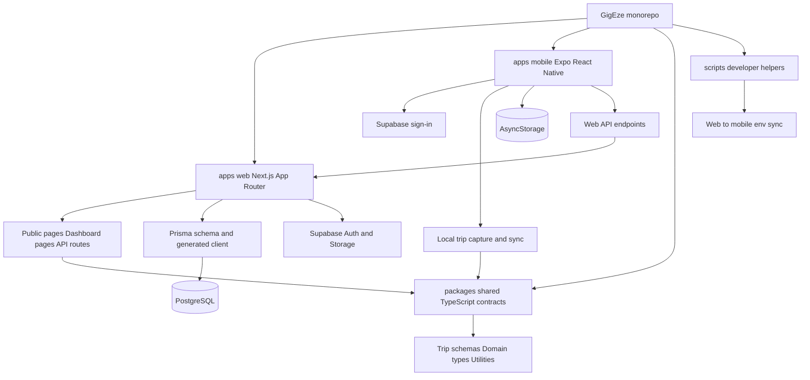

# Architecture Overview

GigEze is an npm-workspaces monorepo that keeps the reviewer path compact: the web app, mobile app, shared TypeScript contracts, database schema, and local scripts live in one repository. It is a working demo scaffold, not a finished SaaS platform.

## Layers

### apps/web

`apps/web` contains the Next.js app: public pages, authenticated dashboard routes, API routes, feature services, validation, Prisma configuration, and Supabase integration helpers. The main review surfaces are `apps/web/src/app`, `apps/web/src/features`, `apps/web/src/lib`, and `apps/web/prisma/schema.prisma`.

### apps/mobile

`apps/mobile` is an Expo React Native app for mobile sign-in, tour selection, vehicle setup, trip capture, trip history, diagnostics, and sync. The trip flow lives mainly in `apps/mobile/src/features/trips` and the screens live in `apps/mobile/src/screens`.

### packages/shared

`packages/shared` holds TypeScript contracts used across app boundaries: trip session schemas, auth/session types, trip mode types, distance utilities, and date helpers. It keeps mobile and web aligned without duplicating core DTOs.

### Prisma/PostgreSQL

The Prisma schema in `apps/web/prisma/schema.prisma` is the source of truth for the relational workflow: workspaces, users, tours, gigs, activity notes, media, public posts, vehicles, driving logs, and GPS samples. PostgreSQL is a good fit because the domain is relationship-heavy and needs scoped queries by workspace, tour, gig, vehicle, visibility, and date.

### Supabase Auth/Storage Integration Points

Supabase Auth is used for sign-in and bearer-token validation on mobile API routes. Supabase Storage is used by the media upload path through `apps/web/src/features/media/supabase-storage-service.ts`. The repository keeps these as integration points and does not include real credentials.

### scripts

`scripts/sync-env-to-mobile.mjs` copies safe public mobile values from `apps/web/.env` into `apps/mobile/.env` so local Expo builds can point at the same Supabase project and web API URL.
