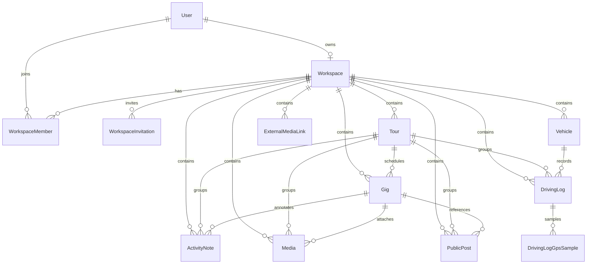

# Data Model

The core data model is defined in `apps/web/prisma/schema.prisma`. The schema is centered on a workspace-owned operational record for tours, gigs, notes, media, and mobile-captured trip activity.

## Core Concepts

### Workspace

`Workspace` scopes the user's content. It owns tours, gigs, vehicles, driving logs, activity notes, media, public posts, external media links, invitations, and default visibility/settings. Most service-layer queries are constrained by `workspaceId`.

### Tour

`Tour` is the parent plan for a run of gigs. It has a title, description, date range, status, visibility, optional cover image, and relationships to gigs, driving logs, media, activity notes, and public posts.

### Gig

`Gig` belongs to a tour through `journeyId`. It captures a location, coordinates, optional arrival/departure dates, visibility, and ordering. Gigs can have notes, media, and posts attached.

### Activity Note

`ActivityNote` records dated work, maintenance, admin, or personal notes against a tour and optionally a gig. It includes duration, location, notes, and visibility.

### Media

`Media` stores uploaded media metadata: storage path, public URL, file details, caption, visibility, and optional tour/gig links. The actual file storage integration is handled through Supabase Storage.

`ExternalMediaLink` separately tracks linked media from platforms such as Flickr, YouTube, Instagram, TikTok, Facebook, or generic URLs against a tour, trip, moment, or story.

### Trip / Field Activity

Mobile trip capture is persisted server-side as `DrivingLog` records. A driving log can be linked to a tour and vehicle, has trip mode (`WALK`, `RIDE`, `DRIVE`), times, locations, odometers, business/personal distance split, purpose, notes, soft-delete state, and optional `DrivingLogGpsSample` route samples.

### Vehicle

`Vehicle` is present in the schema. It belongs to a workspace/user and stores vehicle mode (`RIDE` or `DRIVE`), registration, fuel type, default use, starting odometer, and whether business/personal split is enabled.

## Why Prisma/PostgreSQL Fits

GigEze is a relational workflow: tours contain gigs, users own workspaces, media and notes attach to several domain records, and trip logs need date, vehicle, workspace, and tour filtering. Prisma gives type-safe access to those relationships while PostgreSQL provides durable relational constraints, transactions, indexing, and future reporting/query flexibility.
