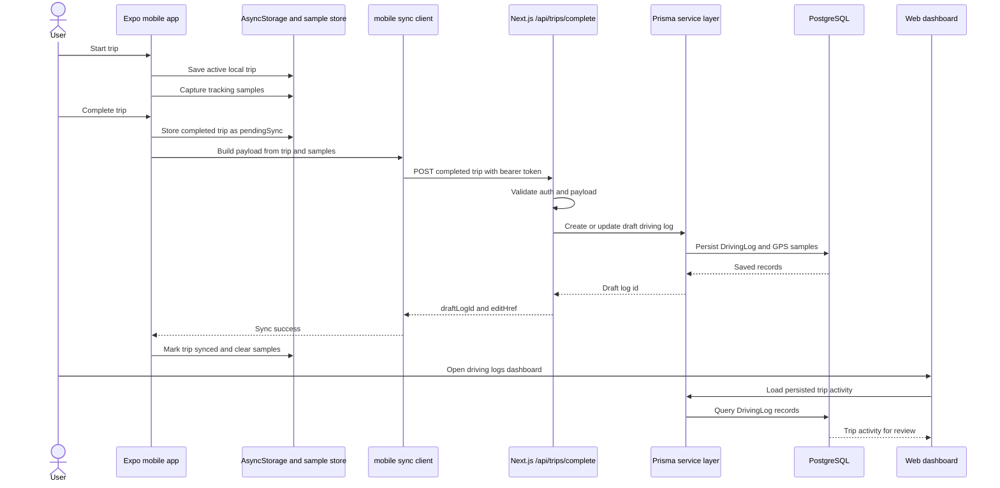

# Mobile Sync

This document covers the completed-trip sync path implemented across `apps/mobile` and `apps/web`. The design is local-first for capture, then retryable once the user has a session and the web API is reachable.

## Design

- Local mobile trip state is stored through `apps/mobile/src/features/trips/trip-storage.ts`, backed by AsyncStorage via `apps/mobile/src/lib/storage/mobile-storage.ts`.
- Active trips are stored separately from recent completed trips.
- Completing a trip in `apps/mobile/src/features/trips/trip-workflow.ts` changes the session to `status: "completed"` and `syncState: "pendingSync"`.
- `TripProvider` in `apps/mobile/src/features/trips/trip-state.tsx` restores interrupted syncs, refreshes remote summaries, and retries pending or failed syncs when the app starts, returns to the foreground, or a trip is completed/edited.
- `syncCompletedTripToBackend` in `apps/mobile/src/features/trips/mobile-sync/sync-client.ts` maps the local session plus tracking samples into the completed-trip payload and posts it to `/api/trips/complete`.
- `apps/web/src/app/api/trips/complete/route.ts` validates the payload, validates auth through Supabase bearer tokens, checks vehicle/tour references, persists a `DrivingLog`, appends `DrivingLogGpsSample` rows when present, and returns the dashboard edit path.
- The web dashboard review path is `/dashboard/logs/driving` and `/dashboard/logs/driving/[logId]/edit`.

## Sequence

## Retry Behavior

The mobile app treats sync as a state machine: `localOnly`, `pendingSync`, `syncing`, `synced`, and `syncFailed`. Interrupted `syncing` trips are recovered as failed with a retry message. If no access token is available, pending trips stay local and receive a user-facing sync error. Successful sync stores the backend driving log id and edit URL on the local completed trip.

Deletion sync uses a parallel state path (`pendingUndo`, `pendingDelete`, `deleting`, `deleted`, `deleteFailed`) and posts deletes to `apps/web/src/app/api/mobile/trips/[tripId]/route.ts`.
